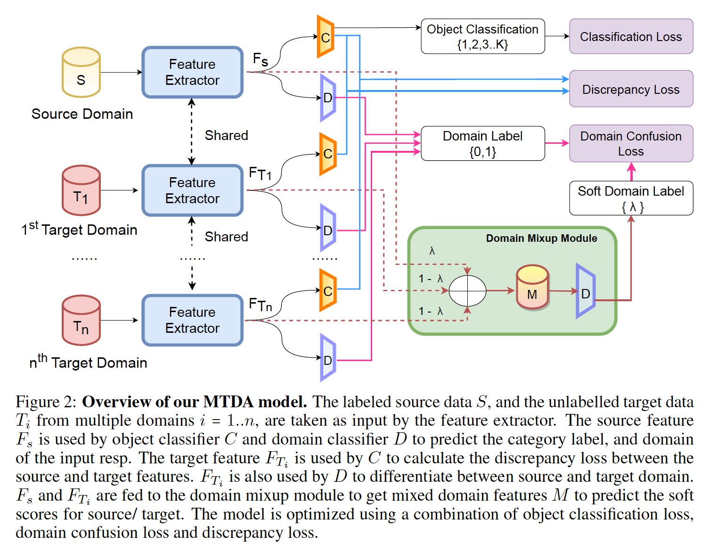
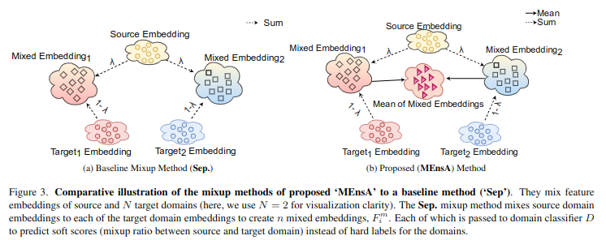
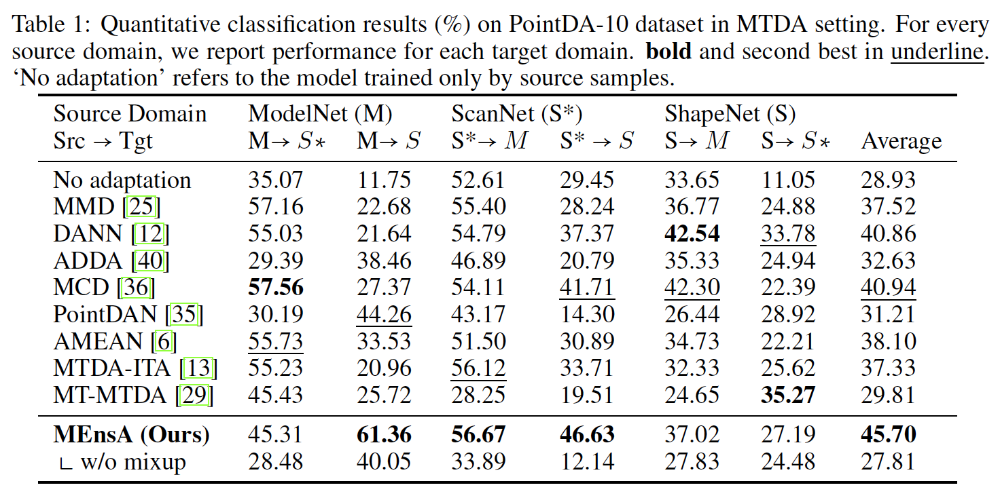
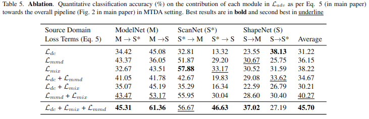

# MEnsA: Mix-up Ensemble Average for UnsupervisedMulti Target Domain Adaptation on 3D Point Clouds

[Ashish Sinha](https://sinashish.github.io) | [Jonghyun Choi](https://ppolon.github.io) | [Paper](https://openaccess.thecvf.com/content/CVPR2023W/L3D-IVU/papers/Sinha_MEnsA_Mix-Up_Ensemble_Average_for_Unsupervised_Multi_Target_Domain_Adaptation_CVPRW_2023_paper.pdf) | [Arxiv](https://arxiv.org/abs/2304.01554) | [](https://zenodo.org/badge/latestdoi/622009986)

📣 Accepted at [Workshop on Learning with Limited Labelled Data](https://sites.google.com/view/l3d-ivu-2023/overview) (CVPR2023)

## 📑 Table of Contents
- [Abstract](#abstract)
- [Pipeline Overview](#pipeline-overview)
- [3D Point Cloud MTDA Results](#3d-point-cloud-mtda-results)
- [Repo Structure](#repo-structure)
- [How to use the code](#running-the-code)
- [Cite](#cite)

## Abstract
<a name="abstract"></a>

Unsupervised domain adaptation (UDA) addresses the problem of distribution shift between the unlabelled target domain and labelled source domain. While the single target domain adaptation (STDA) is well studied in the literature for both 2D and 3D vision tasks, multi-target domain adaptation (MTDA) is barely explored for 3D data despite its wide real-world applications such as autonomous driving systems for various geographical and climatic conditions. We establish an MTDA baseline for 3D point cloud data by proposing to mix the feature representations from all domains together to achieve better domain adaptation performance by an ensemble average, which we call **M**ixup **Ens**emble **A**verage or **MEnsA**. With the mixed representation, we use a domain classifier to improve at distinguishing the feature representations of source domain from those of target domains in a shared latent space. In empirical validations on the challenging PointDA-10 dataset, we showcase a clear benefit of our simple method over previous unsupervised STDA and MTDA methods by large margins (up to 17.10% and 4.76% on averaged over all domain shifts).

<a name="pipeline"></a>

## Pipeline Overview


## Proposed Mixup Schema


<a name = "results"></a>

## 3D Point Cloud MTDA Results 


## Ablation wrt $\mathcal{L}$


<a name="repo"></a>

## Repo Structure
```
.
├── assets                  # paper figures
├── data                    # root dir for data
│   └── PointDA10_data
│       ├── ModelNet10
│       ├── ScanNet
│       └── ShapeNet
├── Dockerfile              # dockerfile for building the container
├── main.py                 # training script
├── saved
│   ├── ckpt                # tensorboard logs
│   └── logs                # model checkpoints
├── models                  # the models
│   ├── ...
├── prepare_dataset.sh      # fetch dataset
├── README.md
├── requirements.txt        
└── src                     # trainer and utility functions
    └── ...
```

## Dependecies
- CUDA:10.2
- CUDNN:7.0
- Python3
- Pytorch:1.7.1
  
## Preparing the Dataset

We use the the benchmark point cloud dataset for domain adaptation – `PointDA-10`  for experimentation.
To download the dataset, and prepare the folder structure. Simplya run,

```bash
bash prepare_dataset.sh
```
## Running the code
<a name="code"></a>

To run the code, for training with default parameters, simply run

```bash
python3 main.py
```

To train a new model with changed hyperparameters, follow this:

```bash
python3 main.py -s <SOURCE DATASET>\
                -e <EPOCHS>\
                -b <BATCH SIZE>\
                -g <GPU IDS>\
                -lr <LEARNING RATE>\
                -mixup <SWITCH MIXING>\
                -mix_sep <TO USE BASELINE MIXUP: SEP>\
                -mix_type <MIXUP VARIANTS: {
                    -1 : MEnsA,
                    0 : Mixup A,
                    1 : Mixup B,
                    2 : Mixup C
                }>\
                -seed <SEED VALUE>\
                -r <CHECKPOINT PATH FOR RESUME TRAINING>\
                -log_interval <LOGGING INTERVAL>\
                -save_interval <SAVE INTERVAL>\
                -datadir <PATH TO DATA>\
                -lambda_mix <LOSS WEIGHT FOR MIXING>\
                -lambda_adv <LOSS WEIGHT FOR ADVERSERIAL LOSS>\
                -lambda_mmd <LOSS WEIGHT FOR MMD LOSS>\
                -gamma <GAMMA WEIGHT>
```

## Running the code in docker

- Create the docker container
    ```bash
    docker build -f Dockerfile -t mtda:pc .
    ```
- Enter the container and mount the dataset 
    ```bash
    docker run -it --gpus all -v </path/to/dataset/>:/data mtda:pc
    ```
- Run the code inside the container using
    ```bash
    CUDA_VISIBLE_DEVICES=<GPU ID> python3 main.py -g <GPU ID> -s <SOURCE DATASET> -mixup 
    ```
- Pre-built [docker image](https://hub.docker.com/r/sinashish/mtda)
    ```bash
    # pull the container from docker hub
    docker pull sinashish/mtda
    # execute the container as usual
    docker run -it --gpus all -v </path/to/dataset/>:/data sinashish/mtda:latest
    ```
<!--
## Pretrained Models

The pretrained models for the experiments are available [here](https://drive.google.com/drive/folders/183RIEz7IpesWSk39rCBIbrg4Wn1Yj62L?usp=sharing).
-->

<a name="cite"></a>
## Cite

If you use any part of the code or find this work useful, please consider citing our work:
```bibtex
@InProceedings{Sinha_2023_CVPR,
    author    = {Sinha, Ashish and Choi, Jonghyun},
    title     = {MEnsA: Mix-Up Ensemble Average for Unsupervised Multi Target Domain Adaptation on 3D Point Clouds},
    booktitle = {Proceedings of the IEEE/CVF Conference on Computer Vision and Pattern Recognition (CVPR) Workshops},
    month     = {June},
    year      = {2023},
    pages     = {4766-4776}
}
```

## Acknowledgements

Some of the code is borrowed from [PointDAN](https://github.com/canqin001/PointDAN). 
